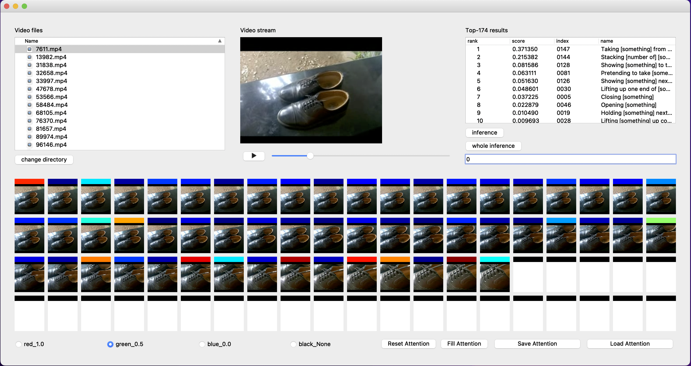
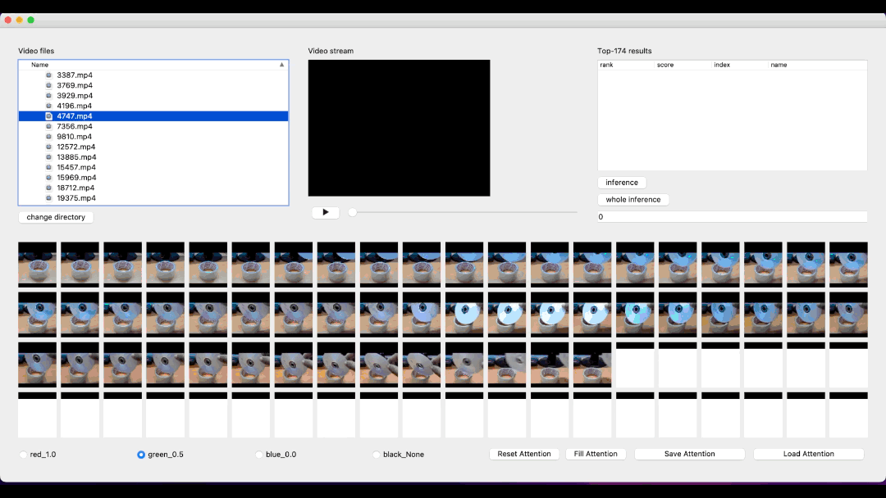

# Attention Editor

  Writer: Saki Noguchi

  This is a tool for temproal attentions' modification.

  

  - Code for the Spatio-Temporal Attention Branch Network :
    [ver2](https://github.com/mprg-smilab/SpatioTemporalAttentionBranchNetwork.git) / 
    [ver1](https://github.com/machine-perception-robotics-group/ST-ABN_PyTorch/tree/9b0f68d7ef40176501465be0d789456beac85e21)
  - Attnetion editor for spatial attentions :
    https://github.com/machine-perception-robotics-group/AttentionEditorABN.git

## Requirements

  We have developed and tested with anaconda3-5.1.0 installed by pyenv

  * Python == 3.6
  * PyQt == 5.6.0
  * mmcv == 0.2.10

## Installation

  Create a conda virtual environment:

    conda create -n py36 python=3.6
    conda activate py36

  Install the following packages:

    conda install pyqt=5.6.0
    conda install nomkl numpy scipy scikit-learn numexpr
    pip install torch==1.7.0 torchvision==0.8.1
    conda install opencv

## Preparation

  * Dataset : Convert the something-something v.2 dataset to .mp4 and put them in `./smth_smth_v2/video`

  * Model : Download the ST-ABN (ResNet 50 backbone) pre-trained model form [here](https://github.com/mprg-smilab/SpatioTemporalAttentionBranchNetwork) into `./checkpoints`

## Usage

  Run tool using the following command:

    python main.py

  The upper left window is used to select the video data to be used.
  The media player in the middle of the top row allows you to view the selected video.
  The upper right window is used to infer the specified video as input and display the inference results.
  The lower section displays frame images and modifies temporal attentions.

  
  <!--  -->

## Reference

  If you find useful for this application, please cite the following reference.

  1.
